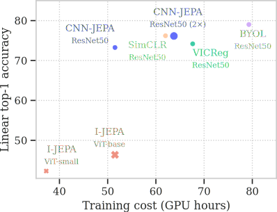

# CNN-JEPA

This repository is the official implementation of [*CNN-JEPA: Self-Supervised Pretraining Convolutional Neural Networks Using Joint Embedding Predictive Architecture*](https://arxiv.org/abs/2408.07514)

[[arxiv](https://arxiv.org/abs/2408.07514)]


Results on ImageNet-100



If you use our code or results, please cite our paper and consider giving this repo a :star: :
```
@misc{kalapos2024cnnjepa,
      title={CNN-JEPA: Self-Supervised Pretraining Convolutional Neural Networks Using Joint Embedding Predictive Architecture}, 
      author={András Kalapos and Bálint Gyires-Tóth},
      year={2024},
      eprint={2408.07514},
      archivePrefix={arXiv},
      primaryClass={cs.CV},
      url={https://arxiv.org/abs/2408.07514}, 
}
```

## Related papers


[1] M. Assran et al., **Self-Supervised Learning From Images With a Joint-Embedding Predictive Architecture**, presented at the Proceedings of the IEEE/CVF Conference on Computer Vision and Pattern Recognition, 2023, pp. 15619–15629. [[paper](https://openaccess.thecvf.com/content/CVPR2023/html/Assran_Self-Supervised_Learning_From_Images_With_a_Joint-Embedding_Predictive_Architecture_CVPR_2023_paper.html)] [[code](https://github.com/facebookresearch/ijepa)]


[2] K. Tian, Y. Jiang, Q. Diao, C. Lin, L. Wang, and Z. Yuan, **Designing BERT for Convolutional Networks: Sparse and Hierarchical Masked Modeling**, presented at The Eleventh International Conference on Learning Representations, Sep. 2022. [[paper](https://openreview.net/forum?id=NRxydtWup1S)] [[code](https://github.com/keyu-tian/SparK)]

[3] K. He, X. Chen, S. Xie, Y. Li, P. Dollár, and R. Girshick, **Masked Autoencoders Are Scalable Vision Learners**, presented at the Proceedings of the IEEE/CVF Conference on Computer Vision and Pattern Recognition, 2022, pp. 16000–16009. [[paper](https://openaccess.thecvf.com/content/CVPR2022/html/He_Masked_Autoencoders_Are_Scalable_Vision_Learners_CVPR_2022_paper.html)]

## How to run
Configs are provided for ImageNet-100 and ImageNet-1k.
```bash
PYTHONPATH=. python pretrain/train_ijepacnn.py --config-name ijepacnn_imagenet.yaml
```
Baseline implementations of the following pretraining approaches are also provided:
- [BYOL](pretrain/train_byol.py)
- [SimCLR](pretrain/train_simclr.py)
- [VICReg](pretrain/train_vicreg.py)
- [Supervised](pretrain/train_supervised.py)


## Setup

We recommend using the provided Docker container to run the code.

### Option A: Start Docker container and connect to it via ssh:
1. Create a keypair, copy the public key to the root of this repo, and edit the Dockerfile accordingly.
2. Run `make ssh`.
3. Connect on port 2222 `ssh root@<hostname> -i <private_key_path> -p 2222`.

Alternatively, to run the container without starting an ssh server, run `make run`.

To customize Docker build and run, edit the [Makefile](Makefile) or the [Dockerfile](Dockerfile).

> :warning: `make ssh` and `make run` start the container with the `--rm` flag! Only contents of the `/workspace` persist if the container is stopped (via a simple volume mount)!

### Option B: Install dependencies locally (not tested)

Install the requirements with `pip install -r requirements.txt`.

## Datasets

To achieve optimal performance on our HPC cluster, we store the datasets in HDF5 format. If
`torchvision.datasets.ImageFolder` datasets are efficient on your system, you can use them instead, by editing lines 182-183 in [pretrain/trainer_common.py](pretrain/trainer_common.py#L182-L183).

To use the datasets in HDF5 format, you need to first download the datasets, extract them to their default ImageFolder format, then convert them to the HDF5 format we use. For the conversion, we provide a function in [data/hdf5_imagefolder.py](data/hdf5_imagefolder.py#L21-L44).

Download the datasets from the following links:
- [ImageNet-100](https://www.kaggle.com/datasets/ambityga/imagenet100)
- [ImageNet-1k](https://www.image-net.org/download.php)


## Copyright, acknowledgements
Our implementation is based on:
- [SparK](https://github.com/keyu-tian/SparK)
- The official [I-JEPA implementation](https://github.com/facebookresearch/ijepa) that pretrains Vision Transformers
